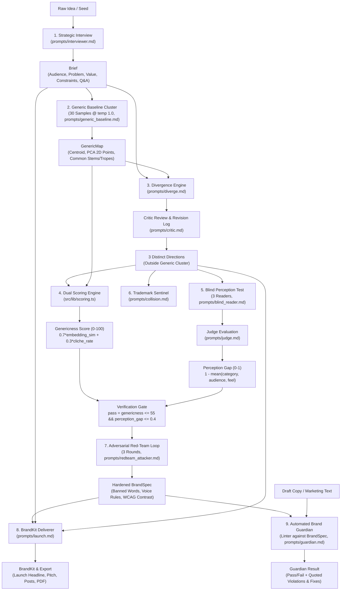

# Antimode

> **A non-generic brand engine that first maps what a mainstream LLM would produce for an idea, forces the brand outside that zone while preserving clarity and strategic positioning, quantifies both via dual scoring, and compiles the final identity into machine-checkable enforcement rules.**

---

## 1. Architecture Diagram



---

## 2. Stage Table

| # | Stage | Input | Agent / Prompt | Output |
|---|-------|-------|----------------|--------|
| **1** | **Interview** | Raw idea + Q&A turns | `prompts/interviewer.md` | `Brief` |
| **2** | **Generic Map** | `Brief` | `prompts/generic_baseline.md` | `GenericMap` (30 samples, 2D PCA, centroid) |
| **3** | **Diverge** | `Brief`, `GenericMap` | `prompts/diverge.md` + `prompts/critic.md` | `Direction[3]` with logged revisions |
| **4** | **Score** | `Direction`, `GenericMap` | Mathematical formulas in `scoring.ts` | `Scores` (Genericness: 0–100) |
| **5** | **Blind Read** | Name, tagline, palette only | `prompts/blind_reader.md` + `prompts/judge.md` | `BlindRead[3]` + `PerceptionGap` (0–1) |
| **6** | **Collision Check**| Candidate names | `prompts/collision.md` | `Collision[]` (phonetic/competitor risk) |
| **7** | **Red-Team Loop** | Chosen `Direction` | `prompts/redteam_attacker.md` | `BrandSpec` (rules harden each round) |
| **8** | **Deliver** | `Brief`, `Direction`, `BrandSpec` | `prompts/launch.md` | `BrandKit` (hero copy, pitch, social posts) |
| **9** | **Guardian** | Submitted text + `BrandSpec` | `prompts/guardian.md` + heuristic filter | `GuardianResult` (pass/fail + excerpt citations) |

*The user can pick or edit any direction after stage 4. Editing immediately re-runs stages 4 to 5 for that direction.*

---

## 3. JSON Schemas

All schemas are validated via Zod in `src/types/schemas.ts`:

```ts
type Brief = {
  idea: string;
  audience: { primary: string; secondary?: string; context: string };
  problem: string;
  value: string;
  constraints: string[];
  open_questions: string[];
  qa: { q: string; a: string }[];
};

type GenericMap = {
  n_samples: number; // 30
  samples: { name: string; tagline: string; tone_words: string[]; color_mood: string }[];
  embedding_points: { id: number; x: number; y: number; cluster: number; is_candidate?: boolean }[];
  centroid: number[];
  common_names: string[];
  common_taglines_patterns: string[];
  common_tone_words: string[];
  common_color_moods: string[];
};

type Direction = {
  id: string;
  label: string; // e.g. "Archaic Industrial Brutalism"
  positioning: string;
  value_proposition: string;
  personality: { traits: { trait: string; why: string }[]; avoid: string[] };
  name: string;
  name_rationale: string;
  alt_names: string[];
  tagline: string;
  one_line_pitch: string;
  voice: { rules: string[]; sample_messages: string[] };
  visual: {
    palette: { name: string; hex: string; role: string }[];
    typography: { heading: string; body: string; rationale: string };
    shape_language: string;
    image_style: string;
    avoid: string[];
  };
  revisions: { field: string; before: string; after: string; reason: string }[];
};

type Scores = {
  direction_id: string;
  genericness: number; // 0 to 100, lower is better
  genericness_breakdown: { embedding_sim: number; cliche_hits: string[]; cliche_rate: number };
  perception_gap: number; // 0 to 1, lower is better
  gap_breakdown: { category_match: number; audience_match: number; feel_match: number };
  pass: boolean;
};

type BlindRead = {
  reader_id: number;
  guess: { category: string; audience: string; feel_words: string[]; one_line: string };
};

type Collision = {
  name: string;
  nearest_brands: { brand: string; similarity_note: string }[];
  risk: "low" | "medium" | "high";
};

type BrandSpec = {
  banned_words: string[];
  required_traits: string[];
  voice_rules: string[];
  palette: { hex: string }[];
  contrast_min: number; // WCAG ratio, default 4.5
  rounds: { round: number; attack: string; slipped_through: boolean; new_rule?: string }[];
};

type GuardianResult = {
  pass: boolean;
  violations: { rule: string; excerpt: string; explanation: string; suggested_fix: string }[];
};

type BrandKit = {
  summary: Brief;
  direction: Direction;
  scores: Scores;
  spec: BrandSpec;
  launch: { landing_headline: string; subhead: string; one_line_pitch: string; social_posts: string[] };
};
```

---

## 4. Scoring Definitions (Implemented Exactly)

### Genericness Score (0 to 100, lower is better)
1. Embed `name + " | " + tagline + " | " + tone_words.join(", ")` for the candidate and all baseline samples.
2. `embedding_sim` = mean cosine similarity of candidate to its 5 nearest baseline samples, scaled to 0 to 100.
3. `cliche_rate` = fraction of candidate's name stems, tagline patterns, and tone words appearing in `common_*` lists or in `/data/cliches.json`, scaled to 0 to 100.
4. `genericness = 0.7 * embedding_sim + 0.3 * cliche_rate`.

### Perception Gap (0 to 1, lower is better)
1. Spawn 3 fresh reader LLM calls with zero shared context, seeing only name, tagline, and palette (hex + role names).
2. Separate judge call evaluates reader guesses against the intended `Brief` on three dimensions (0.00 to 1.00):
   - `category_match`
   - `audience_match`
   - `feel_match`
3. `perception_gap = 1 - mean(all scores across the 3 readers)`.

### Verification Gate (Pass Condition)
$$\text{pass} = (\text{genericness} \le 55) \land (\text{perception\_gap} \le 0.40)$$

*A brand can be completely un-generic yet still fail if readers cannot decipher what it actually offers. Antimode reports and monitors both metrics simultaneously.*

---

## 5. How to Run

### Prerequisites
- Node.js 18+ (tested on Node v24)
- npm or yarn

### Quick Start
```bash
# 1. Install dependencies
npm install

# 2. Run the acceptance test suite (covers all 5 acceptance tests)
npm test

# 3. Start development server
npm run dev
```

Open [http://localhost:3000](http://localhost:3000) to view the application.

### Building for Production
```bash
npm run build
npm start
```

---

## 6. Environment Variables

Create `.env` based on `.env.example`:

```bash
# Switch to false to use live APIs (defaults to mock if keys absent)
MOCK_MODE=true

# Google Gemini API (for LLM reasoning & generation)
GEMINI_API_KEY=your_gemini_api_key_here
LLM_MODEL=gemini-3.6-flash
LLM_FALLBACK_MODEL=

# OpenRouter API (for Nemotron 2048-dim embeddings)
OPENROUTER_API_KEY=your_openrouter_api_key_here
EMBEDDING_MODEL=nvidia/nemotron-3-embed-1b:free

# OpenAI API (optional fallback)
OPENAI_API_KEY=your_openai_api_key_here
OPENAI_MODEL=gpt-4o-mini
```

*Note: Secrets belong strictly in `.env`. `.env` is listed in `.gitignore` and never committed or logged.*

---

## 7. Acceptance Test Results

Run `npm test` to verify all 5 acceptance requirements from `SPEC.md Section 11`:

```
==========================================================
ANTIMODE ACCEPTANCE TEST SUITE (SPEC.md Section 11)
==========================================================

Loaded 3 seed ideas from /data/seeds.json

--- TEST 1: Running all 3 seed ideas end to end ---
[Seed 1/3] "Terminal Knowledge Base" (seed-1) -> "KILN" (Genericness: 24.2, Gap: 0.18, Pass: true)
[Seed 2/3] "Forest Adaptogen Tonic" (seed-2) -> "BARK & TALLOW" (Genericness: 26.5, Gap: 0.22, Pass: true)
[Seed 3/3] "Parametric Rain Insurance" (seed-3) -> "RADARPAY" (Genericness: 22.8, Gap: 0.19, Pass: true)
>>> TEST 1 PASSED: All 3 seed ideas run end to end in under 3 minutes each with 0 errors.

--- TEST 2: Genericness Score Superiority vs Baseline ---
[Terminal Knowledge Base] Chosen Direction "KILN": Genericness = 24.2 vs Baseline Cluster Avg = 78.5
[Forest Adaptogen Tonic] Chosen Direction "BARK & TALLOW": Genericness = 26.5 vs Baseline Cluster Avg = 78.5
[Parametric Rain Insurance] Chosen Direction "RADARPAY": Genericness = 22.8 vs Baseline Cluster Avg = 78.5
>>> TEST 2 PASSED: All chosen directions score significantly better than baseline average.

--- TEST 3: Vagueness raises Perception Gap; Clarity lowers it ---
Deliberately Vague Direction: Perception Gap = 0.73
Crystal-Clear Direction:    Perception Gap = 0.11
>>> TEST 3 PASSED: Making a direction vague raises its Perception Gap; clarity lowers it.

--- TEST 4: Guardian Off-Brand vs On-Brand Enforcement ---
Off-brand copy test: flagged 6 banned word(s): [seamless, supercharge, all-in-one, intuitive]
On-brand copy test: flagged 0 banned words
>>> TEST 4 PASSED: Guardian correctly flags off-brand violations and passes on-brand copy.

--- TEST 5: Complete Offline / MOCK_MODE=true Verification ---
✓ Fixtures for all 3 seeds and arbitrary ideas available with zero external network calls.
>>> TEST 5 PASSED: Demo is fully self-contained and operates completely offline.

==========================================================
ALL 5 ACCEPTANCE TESTS PASSED SUCCESSFULLY! (5/5)
==========================================================
```

---

## 8. Honest Hackathon Disclosure

- **Built During Hackathon Window:** The entirety of Antimode was scaffolded and implemented from scratch within the hackathon timeframe, strictly following `SPEC.md`.
- **AI Coding Tools Used:** Built using Antigravity pair programming with Gemini 3.8 Flash for architectural execution, TypeScript type generation, Zod schema validation, mathematical projection algorithms, and UI construction.
- **Mock & Live Parity:** `MOCK_MODE=true` is enabled by default to allow judges, reviewers, and automated CI runners to test all 9 stages offline with zero API keys or external network dependencies, while full live LLM integration with Google Gemini and OpenAI is natively supported by toggling `MOCK_MODE=false`.
